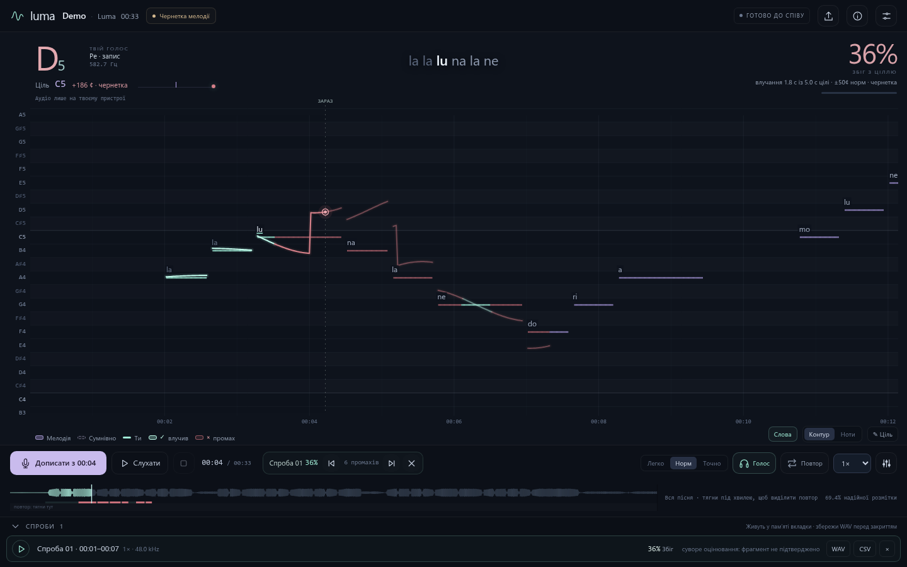

# Luma — sing along with the melody, see every note

Luma turns a song into a single HTML file where you sing over the backing track and watch your pitch against the melody
in real time. Drop a song into **Luma Studio**, wait a few minutes, open the trainer in a browser. No accounts, no uploads
of your voice, no server after the file is built.



## What the trainer does

- **Melody on a piano roll.** Contour or notes view, lyrics sit right above the melody at the moment they are sung, the
  current line is shown at the top.
- **Live match score.** Hits ÷ frames with a target, counted once per 20 ms. Silence under a note is a miss; frames with no
  target are excluded; draft notes count and are labelled as draft. Hit notes turn mint with ✓, misses subdued red with ×.
- **Three levels.** Легко (±80 ¢, octave errors forgiven), Звично (±50 ¢), Точно (±35 ¢); each also sets timing slack and how
  much of a note must be hit. Details in [docs/SCORING.md](docs/SCORING.md).
- **Fragment pitch scale.** The vertical range frames the notes in view plus the next four seconds, so it is already right when a phrase arrives. It grows only when upcoming notes would leave the margin, shrinks after two quiet seconds, and every change eases over a second. Confident voice enters through a percentile band, so a single glitch never moves the plot. Масштаб → Детальніше halves the minimum span.
- **Attempts with history.** Every take keeps its WAV, its timestamped pitch trace and per-frame results. Scrub back to see
  where you drifted, jump between misses, play your voice over the backing in sync, export WAV and CSV.
- **Punch-in.** Seek inside an attempt and "Співати" becomes "Перезаписати з …": the same take is re-recorded from that point. Нова спроба records a separate take; Скасувати перезапис restores the previous version of the last punch.
- **Loop and seek.** Whole song by default; draw an A–B region under the waveform or press A / B while listening, loop it
  without gaps. Seek during playback and the music picks up from there.
- **Vocal on/off.** One button (V) mutes the original vocal stem so you hear only the backing and yourself.
- Two speeds (1× and 0.8× with pitch preserved), vocal octave shift, mix balance, note editor, fragment verification.
- Ukrainian interface. Works offline once built; needs `http://localhost` for the microphone (browsers refuse the audio
  worklet on `file://`).

## Luma Studio: from audio file to trainer

```sh
git clone https://github.com/Latand/luma && cd luma
studio/luma-studio.sh          # creates .venv, installs deps, starts http://127.0.0.1:8792 and opens it
```

Drop an `m4a` / `mp3` / `flac` / `wav`, confirm title and artist (a file named `Song - Artist.m4a` fills them in), press
**Підготувати**. The pipeline (see [docs/PIPELINE.md](docs/PIPELINE.md)):

1. FFmpeg decode
2. official Demucs `htdemucs_ft` vocal separation (weights download once, ~320 MB)
3. pYIN + CREPE pitch on the vocal stem, fused into a note map with a strict reliability mask
4. MP3 stems at 1× and 0.8×
5. optional word timings through the Soniox API (set `SONIOX_API_KEY` or write the key to `~/.config/luma/soniox-api-key`;
   without a key lyrics are skipped)
6. one self-contained HTML in `songs/`

The library on the Studio page serves the trainers over http, so the microphone works out of the box. Додати готовий тренажер imports an existing Luma HTML, preserves its song data, and wraps it in the current app. Imported files get unique names so existing songs are preserved.
Command line equivalent: `.venv/bin/python studio/prepare_song.py song.m4a --title "Song" --artist "Artist"`.

**Hardware.** A 5-minute song takes about 4 minutes on an RTX 3060 (Demucs ≈ 50 s, pYIN ≈ 1 min, CREPE ≈ 30 s). CPU works
and takes considerably longer. Python 3.11, FFmpeg and a few GB of RAM are required; `requirements.txt` pins PyTorch 2.10.

## Honesty about the map

Every automatic map is a draft. Confident (`ok`) frames typically cover 20–35 % of a real song; the rest is instrumental,
uncertain, or vocal styles the estimators cannot follow (screams, distortion, whispers). Draft notes are drawn dashed, the
top-bar pill says "Чернетка мелодії", and strict statistics only apply to fragments you confirm by ear in the app. Octave
mistakes happen; the easy level exists partly for that reason.

## Try it without any song

```sh
.venv/bin/python examples/make_demo.py      # synthesizes a short original melody + backing and builds examples/demo/Luma_Demo.html
```

## Tests

```sh
bun add -d playwright && bunx playwright install chromium   # or npm
tests/e2e/run.sh
```

`scoring.mjs` checks the engine (correct / wrong / uncertain / silence / no-target / no double counting), trace persistence,
seek and miss navigation, lyrics. `audio.mjs` drives the real audio path with Chrome's fake microphone: seamless loop, live
seek, vocal toggle, recording, punch-in, review playback. Both require a clean console. Set `LUMA_BROWSER=/path/to/chrome`
to use a specific Chromium build.

## Layout

```
app/       head.html (styles + markup, {{TITLE}} / {{ARTIST}} placeholders), workers.html (AudioWorklet capture + YIN worker), app.js
studio/    prepare_song.py (pipeline), build_html.py (package → HTML, --rebuild), studio_server.py + studio.html, luma-studio.sh
examples/  make_demo.py (synthetic demo song)
tests/e2e/ Playwright suites
docs/      TARGET_MAP_SCHEMA.md, PIPELINE.md, SCORING.md, screenshots
```

Updating the app for already built trainers: `studio/build_html.py --rebuild songs/Luma_*.html` keeps each file's song
data byte-for-byte and swaps in the current `app/` parts.

## Privacy

The trainer makes no network requests. Recordings live in the tab's memory until you save them. The Studio sends audio to
Soniox only when a key is configured, only for word timings.

## License

MIT. Demucs, torchcrepe, librosa and Soniox are separate projects with their own licenses and terms; you are responsible
for the rights to the audio you process.
